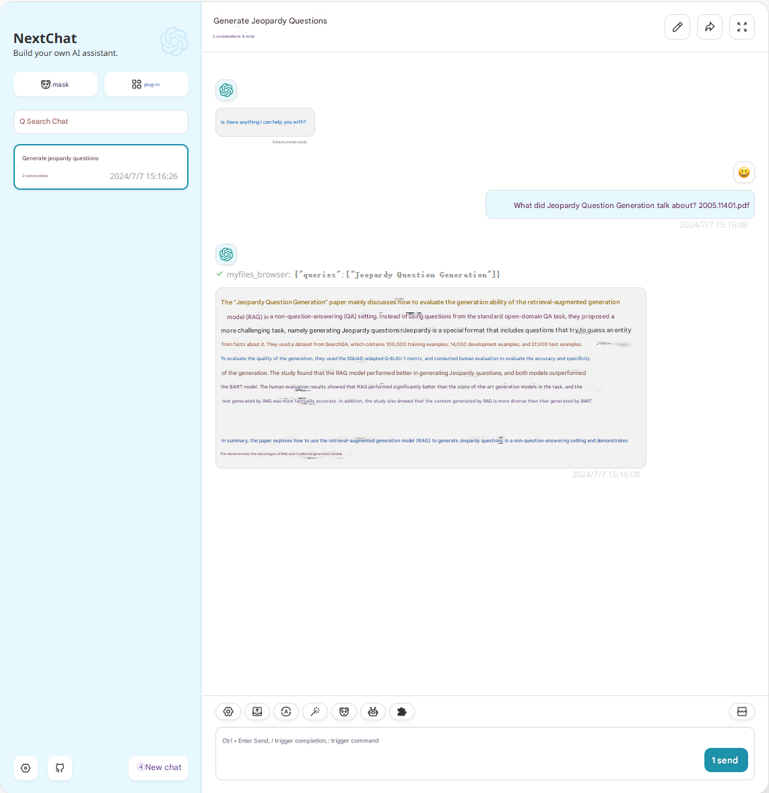
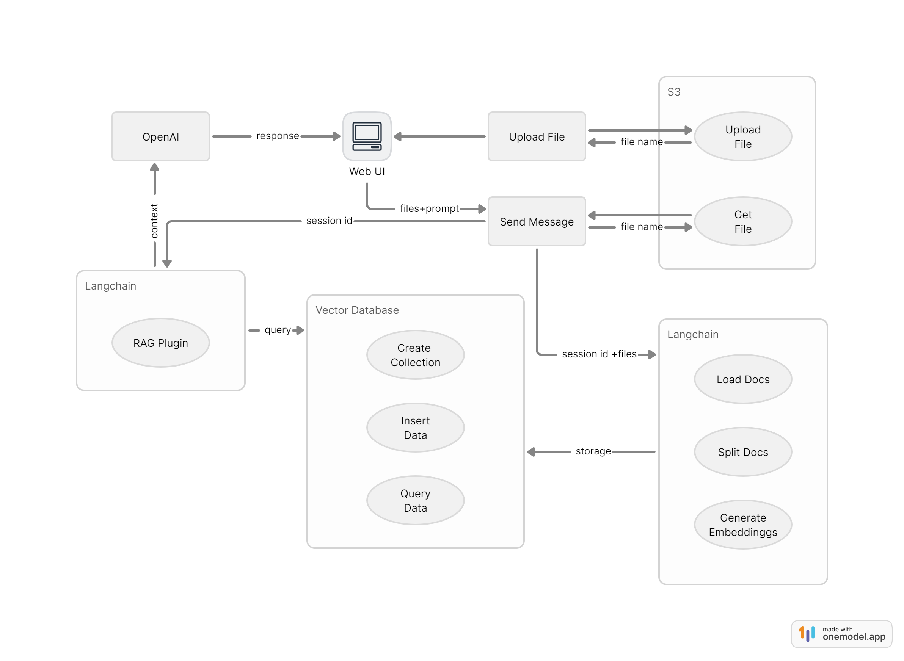

# RAG Function Configuration Guide

> [!WARNING]
> The new version has changed the vector database from qdrant to supabase, please pay attention to the related parameter changes!
> 
> Deploying on Vercel requires configuring the environment variable NEXT_PUBLIC_ENABLE_NODEJS_PLUGIN=1 to force enable the node runtime, but the free version of Vercel has many restrictions on the node runtime, so it is not recommended to use it on Vercel.

## Effect Image



## Principle

The following is the principle of early implementation, some logic may differ from the latest version, for reference only.



## Usage Notes

- Due to the use of the nodejs runtime in the API, there may be timeouts in the Vercel environment, it is recommended to deploy using Docker.
- Other plugins may affect the model's call to the RAG retrieval plugin, so the current approach is to keep only the RAG plugin enabled by default after uploading files, while other plugins will be disabled.
- The created vector data will not be deleted.
- In the same chat window, even if "clear chat" is used, the content of already uploaded files can still be accessed.

## Supported File Types

- txt
- md
- pdf
- docx
- csv
- json
- srt
- mp3 (based on OpenAI Whisper)

## Configuration

1. Log in to https://supabase.com and create an account.
2. Create a project in the dashboard.
3. In `Project Settings` `API Settings`, obtain the `URL` and `service_role secret`.
4. In the `SQL Editor`, execute the following script to create tables and functions (modify the vector(1536) dimension data according to [model dimension reference]).

```sql
-- Enable the pgvector extension to work with embedding vectors
create extension vector;

-- Create a table to store your documents
create table documents (
  id bigserial primary key,
  content text, -- corresponds to Document.pageContent
  metadata jsonb, -- corresponds to Document.metadata
  embedding vector(1536) -- 1536 works for OpenAI embeddings, change if needed
);

-- Create a function to search for documents
create function match_documents (
  query_embedding vector(1536),
  match_count int DEFAULT null,
  filter jsonb DEFAULT '{}'
) returns table (
  id bigint,
  content text,
  metadata jsonb,
  embedding jsonb,
  similarity float
)
language plpgsql
as $$
#variable_conflict use_column
begin
  return query
  select
    id,
    content,
    metadata,
    (embedding::text)::jsonb as embedding,
    1 - (documents.embedding <=> query_embedding) as similarity
  from documents
  where metadata @> filter
  order by documents.embedding <=> query_embedding
  limit match_count;
end;
$$;
```

5. Complete the environment variable configuration below to use it.

## Environment Variables

### `ENABLE_RAG`
If you want to enable the RAG function, set this environment variable to 1.

### `SUPABASE_URL`
The URL of the Supabase project.

### `SUPABASE_PRIVATE_KEY`
The service_role secret of the Supabase project.

### `RAG_CHUNK_SIZE` (optional)
The maximum size of the document after splitting (calculated by character count), default: 2000.

### `RAG_CHUNK_OVERLAP` (optional)
The number of overlapping chunks when splitting the document, default: 200.

### `RAG_RETURN_COUNT` (optional)
The number of documents to return during retrieval, default: 4.

### `RAG_EMBEDDING_MODEL` (optional)
The vector model used for embedding, default: text-embedding-3-large.  
Options:
- text-embedding-3-small
- text-embedding-3-large
- text-embedding-ada-002

### `OLLAMA_BASE_URL` (optional)
New support for Ollama embedding model.

Configure this as the Ollama service address, e.g., http://localhost:11434.

After configuration, please change the parameter `RAG_EMBEDDING_MODEL` to the name of the Ollama embedding model.

The `vector(1536)` in the above database initialization statement should also be modified to the dimension used by your vector model.

## Model dimension reference

| Embedded model name    | Dimension |Provider|
| ---------------------- | --------  | ------ |
| text-embedding-3-small | 1536      | openai |
| text-embedding-3-large | 3072      | openai |
| text-embedding-ada-002 | 1536      | openai |
| snowflake-arctic-embed | 1024      | ollama |
| mxbai-embed-large      | 1024      | ollama |
| nomic-embed-text       | 768       | ollama |