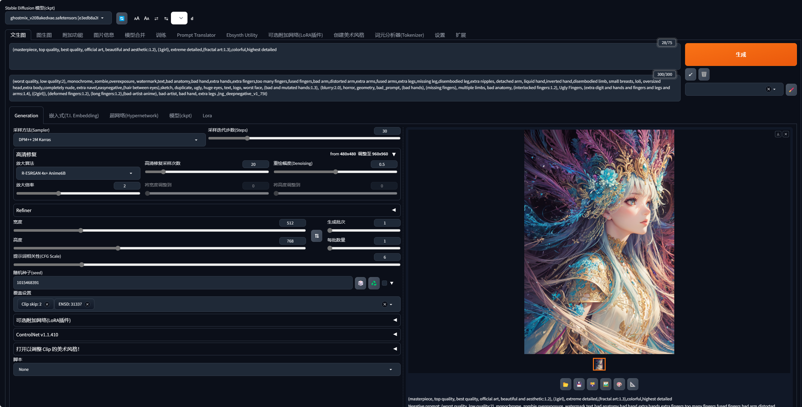

# Stable Diffusion Plugin Configuration Guide

## Prerequisites

1. Deploy the [stable-diffusion-webui](https://github.com/AUTOMATIC1111/stable-diffusion-webui) project and ensure it is working properly (Required).

2. Choose a base model from [Civitai](https://civitai.com/) (Optional).

3. Generate an image and note the relevant parameter settings (Optional).

   

## Environment Variables

- `STABLE_DIFFUSION_API_URL` (Required)

  The API URL for the stable-diffusion-webui service. Example: `http://127.0.0.1:7860`

- `STABLE_DIFFUSION_NEGATIVE_PROMPT` (Optional)

  The negative prompt, default value: `longbody, lowres, bad anatomy, bad hands, missing fingers, extra digit, fewer digits, cropped, worst quality, low quality`

- `STABLE_DIFFUSION_STEPS` (Optional)

  The number of sampling steps, default value: `20`

- `STABLE_DIFFUSION_CFG_SCALE` (Optional)

  The prompt relevance (CFG Scale), default value: `7`

- `STABLE_DIFFUSION_WIDTH` (Optional)

  The width of the generated image, default value: `720`

- `STABLE_DIFFUSION_HEIGHT` (Optional)

  The height of the generated image, default value: `720`

- `STABLE_DIFFUSION_SAMPLER_INDEX` (Optional)

  The sampler method, default value: `Euler a`

## How to Use

Due to the limited character count in OpenAI's function descriptions, it is difficult to effectively convey the Stable Diffusion prompt rules to GPT. Therefore, we provide a Stable Diffusion mask to indirectly tell GPT how to call the Stable Diffusion plugin. For detailed instructions, please refer to the mask's prompt, which you can modify as needed.

Please note that R2 storage may not work properly in the Chinese network environment. Ensure that your network can access R2 storage services, or this plugin will not function properly.

1. First, configure the plugin variables as described in the sections above.

2. Enable the StableDiffusion plugin in the plugin manager.

   

3. Find the StableDiffusion mask and interact with it.

   

4. Enjoy using the plugin!

## Example


Model: [GhostMix - v2.0-BakedVAE | Stable Diffusion Checkpoint | Civitai](https://civitai.com/models/36520/ghostmix)

Environment Variables:

```
STABLE_DIFFUSION_API_URL=http://127.0.0.1:7860
STABLE_DIFFUSION_WIDTH=512
STABLE_DIFFUSION_HEIGHT=768
STABLE_DIFFUSION_NEGATIVE_PROMPT=(worst quality, low quality:2), monochrome, zombie, overexposure, watermark, text, bad anatomy, bad hand, extra hands, extra fingers, too many fingers, fused fingers, bad arm, distorted arm, extra arms, fused arms, extra legs, missing leg, disembodied leg, extra nipples, detached arm, liquid hand, inverted hand, disembodied limb, small breasts, loli, oversized head, extra body, completely nude, extra navel, easynegative, (hair between eyes), sketch, duplicate, ugly, huge eyes, text, logo, worst face, (bad and mutated hands:1.3), (blurry:2.0), horror, geometry, bad_prompt, (bad hands), (missing fingers), multiple limbs, bad anatomy, (interlocked fingers:1.2), Ugly Fingers, (extra digit and hands and fingers and legs and arms:1.4), ((2girl)), (deformed fingers:1.2), (long fingers:1.2), (bad-artist-anime), bad-artist, bad hand, extra legs, (ng_deepnegative_v1_75t)
STABLE_DIFFUSION_STEPS=30
STABLE_DIFFUSION_CFG_SCALE=6
```